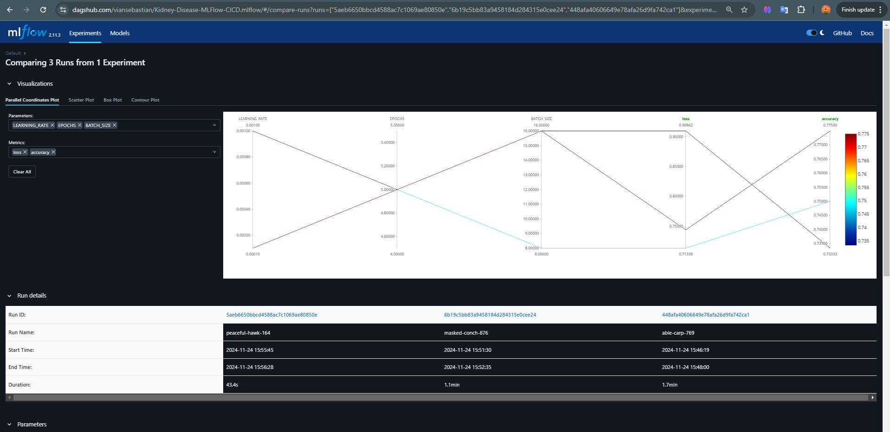
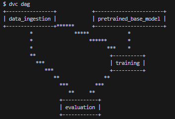
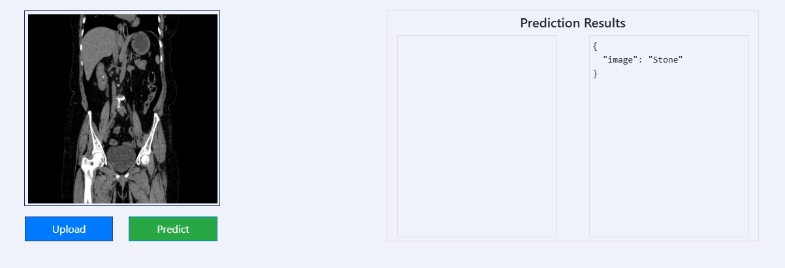

# Kidney-Disease-MLFlow-CICD

This repository is a self-learn end-to-end machine learning project, where I implemented:
- Data Scraping using Google Colab and Drive
- Data Ingestion
- Data Transformation (+ Augmentation)
- Model Development
- Model Experimentation using MLFlow 
- Data Versioning Control (DVC) for efficiency
- Deployment with CI/CD to AWS EC2 Instance

*AWS deployment will be offline soon to save costs :)*

### MLFlow Experiment


### DVC Structure


DVC itself is the best thing I have learned in this project, as it really boosted efficiency and reduces redundancy. Implementing this allows me to perform experimentation without actually running the whole pipeline, saving computation and time greatly.

--- 

The project itself aims to deploy a kidney disease classification task, analyzing CT scan images to classify healthy, tumorous, or kidney stone. I implemented a MobileNetV2 transfer learning for a balance between speed and performance in training. 




### To run this app: 
1. Head over to the dataset, and download some images! [Dataset](https://www.kaggle.com/datasets/nazmul0087/ct-kidney-dataset-normal-cyst-tumor-and-stone)

*It is recommended to use the Kaggle API to only donwload some images instead of everything*

2. Pull and Run Docker Image

```bash
docker pull viansebastian/kidney-classifier:latest
docker run -p 8080:8080 viansebastian/kidney-classifier
```

3. You're all set! Input your images!
